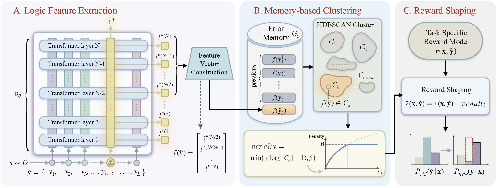

<p align="center">
  
  <br><br>

  
  <br><br>

  <a href="http://arxiv.org/abs/2604.11297">
    
  </a>

  <a href="https://huggingface.co/papers/2604.11297">
  
  </a>
</p>

## Overview
<div align="center">
  
</div>

<b>MEDS</b>💊 (<b>M</b>emory-<b>E</b>nhanced <b>D</b>ynamic <b>R</b>eward <b>S</b>haping) is a memory-enhanced RL training recipe for LLMs built on top of [veRL](https://github.com/volcengine/verl). Unlike standard memoryless reward designs, MEDS incorporates historical error signals into reward shaping, allowing the training process to recognize and discourage repeated mistakes.

To achieve this, MEDS reuses layer-wise logits from the forward pass as lightweight representations of reasoning behavior, clusters similar error patterns, and applies stronger penalties to repeated failures. This encourages broader exploration and leads to better reasoning performance and greater sampling diversity.

## Contents

- [Overview](#overveiw)
- [Getting Started](#getting-started)
  - [Environment Setup](#environment-setup)
  - [Training with MEDS](#training-with-meds)
- [Configuration](#configuration)
- [Evaluation](#evaluation)
- [Data Preparation](#data-preparation)
- [Citation](#citation)
- [License](#license)

## Getting Started

### Environment Setup

```bash
# Clone the MEDS repository
git clone https://github.com/Linxi000/MEDS.git
cd MEDS

# Create a new conda environment
conda create -n meds python=3.10
conda activate meds

# Install Python dependencies
pip install -r requirements.txt
```

MEDS is built on top of veRL. Please follow the [veRL installation guide](https://github.com/volcengine/verl) to set up the framework, then place the MEDS directory into your verl repo root to get started.

In addition to the standard veRL installation, MEDS depends on updated code components in the following veRL files:

- `verl/workers/fsdp_workers.py`: includes MEDS-related worker-side logic used during rollout/training.
- `verl/workers/actor/dp_actor.py`: includes MEDS-related actor-side logic used for reward shaping behavior.

Before training, make sure these two files are synced with the MEDS-integrated version in this repository.

### Training with MEDS

Set the required paths and launch training:

```bash
export MODEL_PATH="${HOME}/models/Qwen2.5-Math-7B"  # Base model path
export TRAIN_FILE="${HOME}/data/unified_math.parquet"
export TEST_FILE="${HOME}/data/aime-2024.parquet"
export CKPTS_DIR="${HOME}/ckpts/MEDS/meds_7b"

bash recipe/meds/run_meds.sh
```

This runs MEDS training with the default configuration (Qwen2.5-Math-7B, 8 GPUs per node, 100 epochs).

## Configuration

Key hyperparameters in `recipe/meds/run_meds.sh`:


| Parameter                | Default   | Description                                                      |
| ------------------------ | --------- | ---------------------------------------------------------------- |
| `cluster_method`         | `hdbscan` | Clustering algorithm for error pattern grouping                  |
| `use_layer_diff`         | `False`   | Whether to use layer-difference features for clustering          |
| `use_last_n_layers`      | `14`      | Number of last transformer layers used for clustering            |
| `cluster_penalty_target` | `wrong`   | Which responses to penalize: `wrong` / `right` / `both` / `none` |
| `penalty_coef`           | `0.1`     | Strength of the diversity penalty                                |


Fine-grained Hydra config options are in `recipe/meds/config/meds_trainer.yaml`.

## Evaluation

Our evaluation pipeline fully follows the official open-source implementation from [LIMO](https://github.com/GAIR-NLP/LIMO), particularly its evaluation module.

First, install the required dependencies under the `LIMO/eval` directory:

```bash
pip install -r requirements.txt
```

To launch the full evaluation pipeline, run:

```bash
bash eval.sh
```

To evaluate a specific checkpoint, update the `--model_name_or_path` argument in `eval.sh` to point to your target checkpoint directory.

To change the number of GPUs or specify particular devices, modify `CUDA_VISIBLE_DEVICES` in the script. For example:

```bash
CUDA_VISIBLE_DEVICES=0,1,2,3
```

To evaluate pass@k, adjust the following parameters:

- `n_sampling`: total number of samples generated per problem
- `k`: the k value used for pass@k computation

The maximum generation length used in our experiments is `max_tokens = 8192`.

## Data Preparation

The training set is a unified math dataset combining [DAPO-Math-17K](https://huggingface.co/datasets/BytedTsinghua-SIA/DAPO-Math-17K) and difficulty levels 3–5 of [MATH-lighteval](https://huggingface.co/datasets/DigitalLearningGmbH/MATH-lighteval), with deduplication applied. The validation set is [AIME 2024](https://huggingface.co/datasets/HuggingFaceH4/aime_2024).

## Citation

If you find our work helpful, please consider citing:

```bibtex
@article{liu2026meds,
  title={The Past Is Not Past: Memory-Enhanced Dynamic Reward Shaping},
  author={Liu, Yang and Wang, Enxi and Gao, Yufei and Zhang, Weixin and Wang, Bo and Zeng, Zhiyuan and Zhang, Yikai and Zheng, Yining and Qiu, Xipeng},
  journal={arXiv preprint arXiv:2604.11297},
  year={2026}
}

```

## License

This project is licensed under the [Apache-2.0 License](LICENSE).

## Acknowledgments

We gratefully acknowledge the open-source projects that made this work possible. This project is built on top of the [veRL](https://github.com/volcengine/verl) framework, uses [HDBSCAN](https://github.com/scikit-learn-contrib/hdbscan) for clustering, and is partly inspired by [DAPO](https://github.com/BytedTsinghua-SIA/DAPO). Our models are trained based on [Qwen2.5](https://qwenlm.github.io/blog/qwen2.5/) and [Qwen3](https://qwenlm.github.io/blog/qwen3/). We sincerely thank the contributors and maintainers of these projects for their valuable contributions to the open-source community.